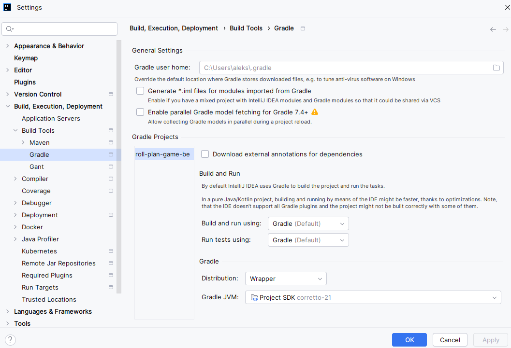
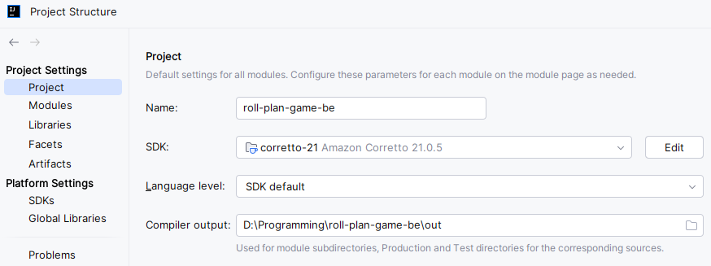
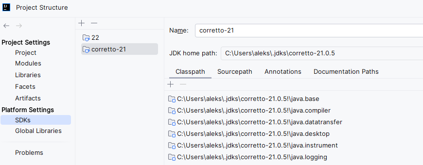
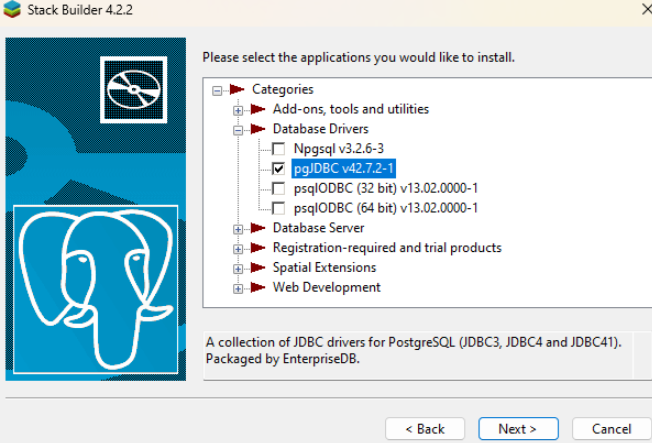
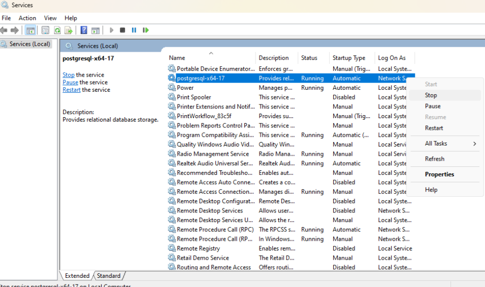
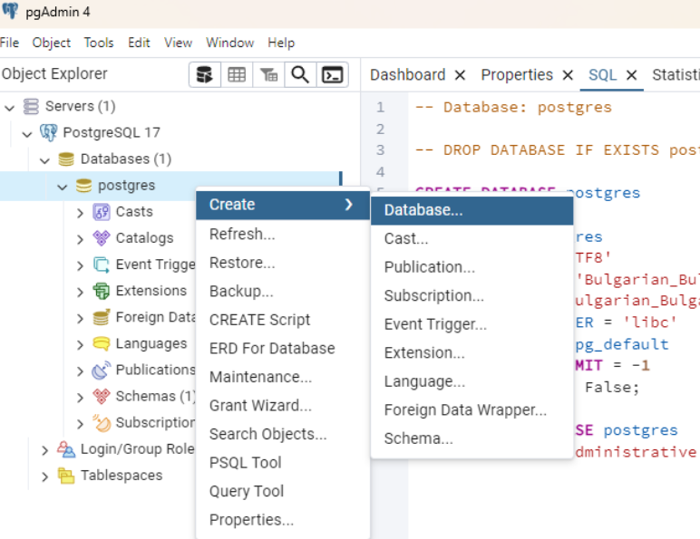
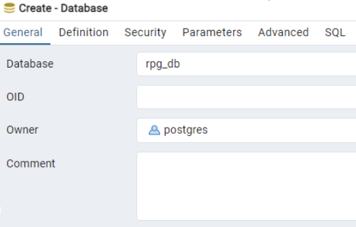
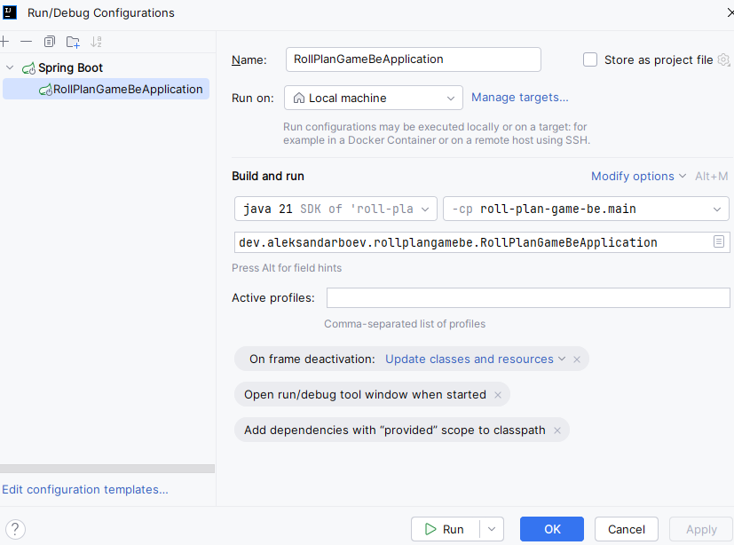

# Roll Plan Game Backend

This is a Spring Boot backend service for the Roll Plan Game application. It provides RESTful APIs to handle game logic, authentication (using JWT), and other backend operations.

## Table of Contents
- [First Time Setup](#first-time-setup)
- [Running the Application](#running-the-application)
- [Versions](#versions)

## First time Setup

1. **Clone the repository**
   ```bash
   git clone https://github.com/AleksandarBoev/roll-plan-game-be.git

2. **Install JDK 21**

IntelliJIdea to install needed jdk. Pick the Amazon corretto 21 version.
Alternatively, you can download it from here: https://docs.aws.amazon.com/corretto/latest/corretto-21-ug/downloads-list.html
These settings should be applied out of the box, but if you are having issues and need to modify them, they should look like this:







3. **First Time PostregSQL Database Setup**

Download version 17.2 from here: https://www.enterprisedb.com/downloads/postgres-postgresql-downloads

During installation, when asked about username and password, input the values from **application.properties** for
*spring.datasource.username* and *spring.datasource.password*. This is done so that the application can connect to the database.

When asked about port, put "5432". Same reason as above.

Accept all additional software, recommended during this installation.

After installation is done, you will be prompted to install additional software via "stack builder".
Accept. And install the jdbc driver:



After installations are done, you need to create the database for the app.
Find the application "pgAdmin 4". This is used to make SQL queries (and more) against
the database. You start/stop the db server by using "Services":



When connecting, put the password you used during installation. After connecting, create the database:



Name needs to be "rpb_db":



If you want to run queries via this tool, right-click on the newly created database and pick "Query Tool".

## Running the Application
IntelliJ idea should autoconfigure the run. In case this does not happen, you need to set it up. Should look like this:



## Versions

| Version | Description                                                                                                                      |
|---------|----------------------------------------------------------------------------------------------------------------------------------|
| 0.2.0   | Bypass Spring security temporarily, setup db config properties, implement basic user db persistence, add project setup in README |
| 0.1.0   | Add initial Spring Setup                                                                                                         |
